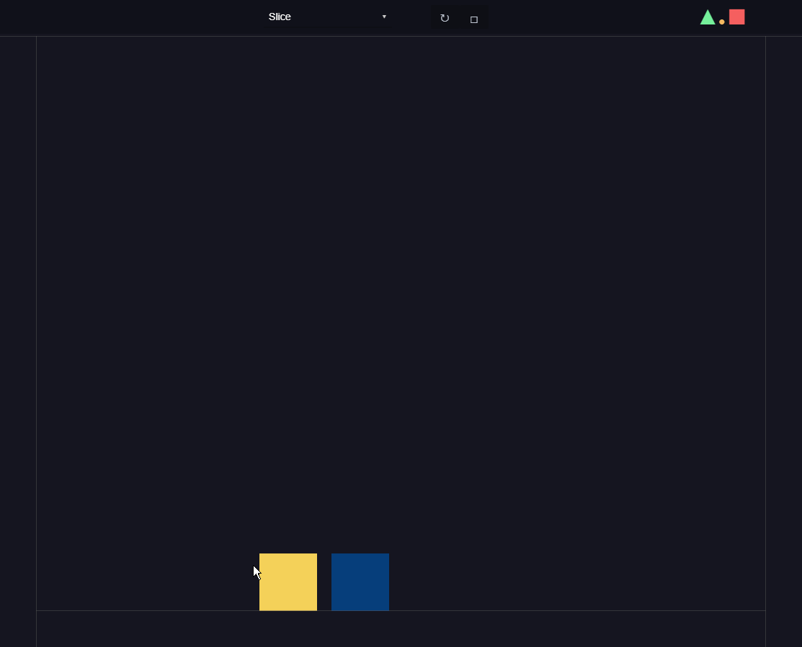
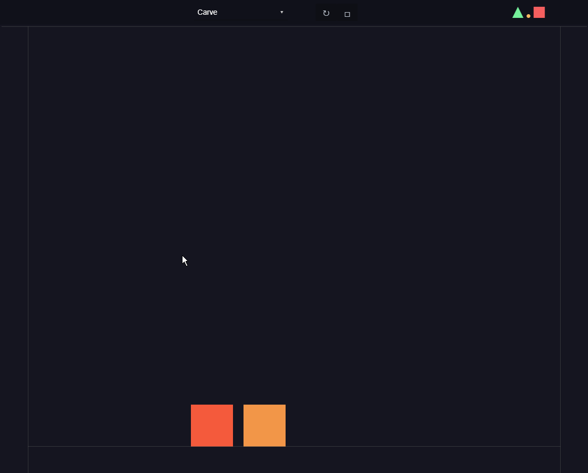

# Matter.js Experiments
 A handful of playful experiments with [Matter.js](https://brm.io/matter-js/)

## Setup
1. Clone this repo
2. Start the server: `python -m http.server` (or other similar command)
3. Open `localhost:8000` in your browser
4. Have fun!

## Experiments
### Slice
Slice a body in two by clicking and dragging. The slice is made by partitioning the body with [PolyK](https://polyk.ivank.net/?p=demos&d=slice) and converting the resulting vertex arrays into Matter.js bodies. Additional realism is achieved through the conservation of momentum and tangential velocities. The dot product is used to apply force when you slice a body upwards. See how long you can keep a piece in the air!

### Carve (WIP)
This experiment will allow you to carve a body by clicking and dragging. While the carving mechanic is incomplete, you can still create laser light shows with the mouse!

### Planets
Watch the formation of a 2D planetary system! This experiment utilizes the [matter-attractors](https://github.com/liabru/matter-attractors) plugin to simulate gravity between bodies. The simulation is initialized with 3000 randomized orbital velocities and masses. The radius of each body has been scaled up to make the systems more visually appealing. Bodies that touch are merged at their barycenter, with their mass and velocity conserved. Performance is improved by only considering the gravitational effect of the sun on each body since the relative mass of the other bodies is negligible.

### Boids
Enjoy flocks of bird-like agents (boids) that exhibit emergent behavior using three simple rules: alignment, cohesion, and separation. Alignment steers boids towards the average heading of their neighbors. Cohesion steers boids towards the average position of their neighbors. Separation steers boids away from their neighbors to avoid crowding. The boids will gently swerve away from the mouse to avoid it. The [matter-wrap](https://github.com/liabru/matter-wrap) plugin is used to wrap the boids around the screen. Screen wrapping is disabled by default in favor of the boids redirecting themselves at the edges of the screen, resulting in more interesting behavior.

The boids algorithm was first developed by Craig Reynolds in 1986, detailed further in his [paper presented at SIGGRAPH'87](https://citeseerx.ist.psu.edu/doc/10.1.1.317.3619). While there are many online resources about boids, I found [this lab](https://people.ece.cornell.edu/land/courses/ece4760/labs/s2021/Boids/Boids.html#Recommended-parameter-values) published by the Cornell Department of Electrical and Computer Engineering especially helpful in understanding the algorithm and tuning its parameters.

